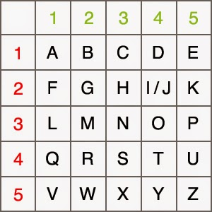

# Decoder Ring

## Getting Started
To get started with your project, follow these steps:

1. Clone the repository from GitHub.
2. Install the dependencies.
3. Run the project.

## Features
### The Caesar Shift Cipher
The Caesar shift is a type of substitution cipher originally used by Julius Caesar to protect messages of military significance. It relies on taking the alphabet and "shifting" letters to the right or left, based on the typical alphabetic order.

For example, if you were to "shift" the alphabet to the right by 3, the letter A would become D.

"This is a code." -> "wklv lv d frgh."

When decoding the message, you need to know the number the original message was shifted by so that you can shift in the opposite direction.

### The Polybius Square

The Polybius square is a cipher that is achieved by arranging a typical alphabet into a grid. Each letter is represented through a coordinate. For example, in the above table, the letter B would be represented by the numerical pair 21.

Typically, it is possible to arrange the letters however you like and read off the coordinates in whatever direction you like. In this example, the grid will be arranged as above and coordinates will be read by comparing the first digit to the number on the top of the table and the second digit to that on the left.

"This is a code." -> "44324234 4234 11 31434151"

When decoding the message, each pair of numbers is translated using the coordinates.

### Substitute Cipher

The substitution cipher requires a standard alphabet and a substitution alphabet. Letters from the standard alphabet will be transposed to the substitution alphabet. This cipher requires that the recipient have the substitution alphabet, otherwise it will be difficult for them to decode the message.

For example, in the image above, the word HELLO would be translated as follows:

    H becomes R.
    E becomes M.
    L becomes W.
    O becomes L.

This would result in the code RMWWL. To decrypt this code, you would simply take the result and transpose back from the substitution alphabet to the standard alphabet.

## Usage

To use these ciphers you click on either `Encode`, and then type in your message you would like to encode, or `Decode`, and then type in the encoded message you would like to decode.

#### Caesar Shift
Indicate the amount you would like to shift by selecting a number between 1 and 25, or -1 and -25, to encode. To decode you set the `Shift number` to the number that is proveded with the encoded message.

#### Polybius Square
Simply type in the message to encode, or the numbers, including spaces, that you would like to decode.

#### Substitute Cipher
This one requires a message, either to encode or decode, and a 26 character "Alphabet key", which can include special characters.

Ex: "zxcvbnm?kjhgfd$aqwerty.iop"

All messages will show in the `Output` footer below the cipher.